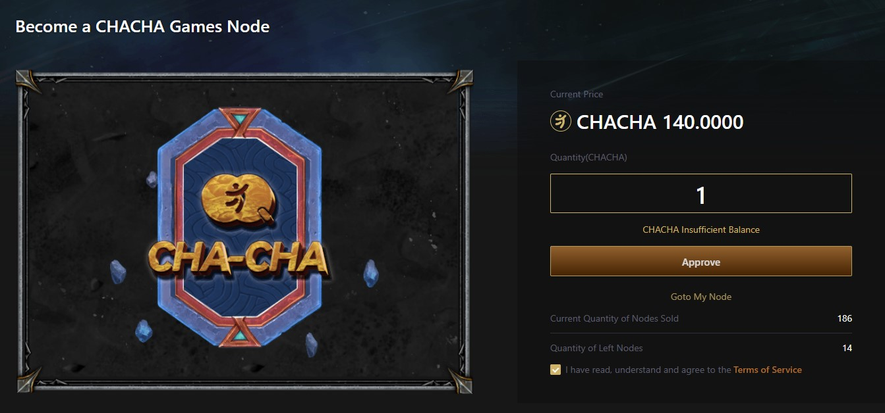
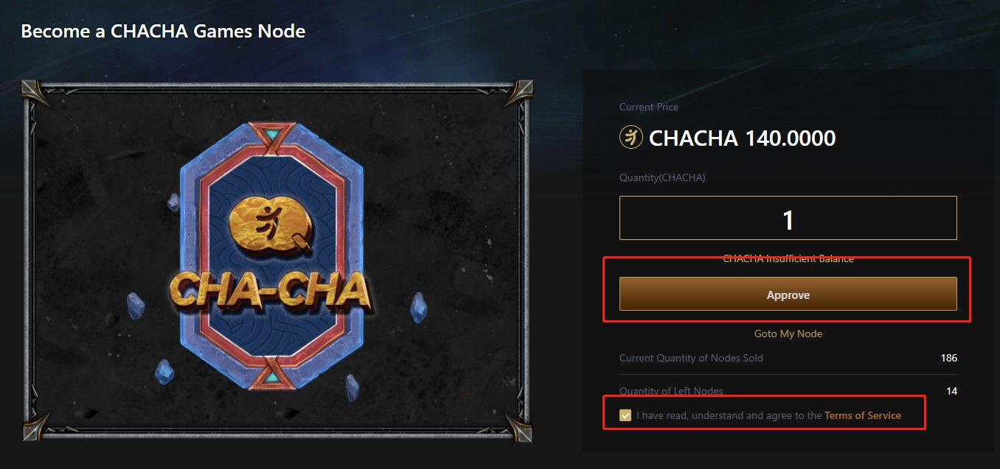
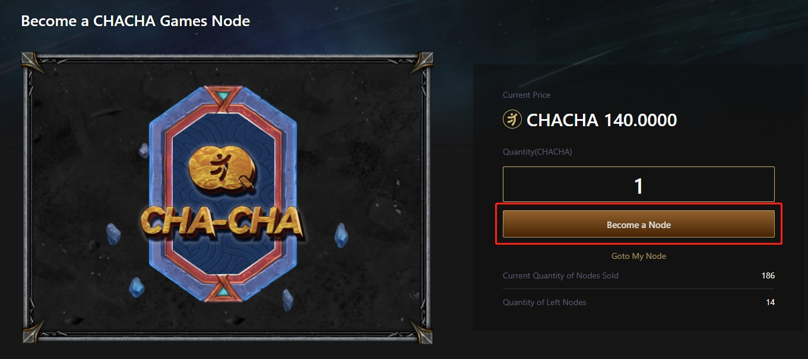
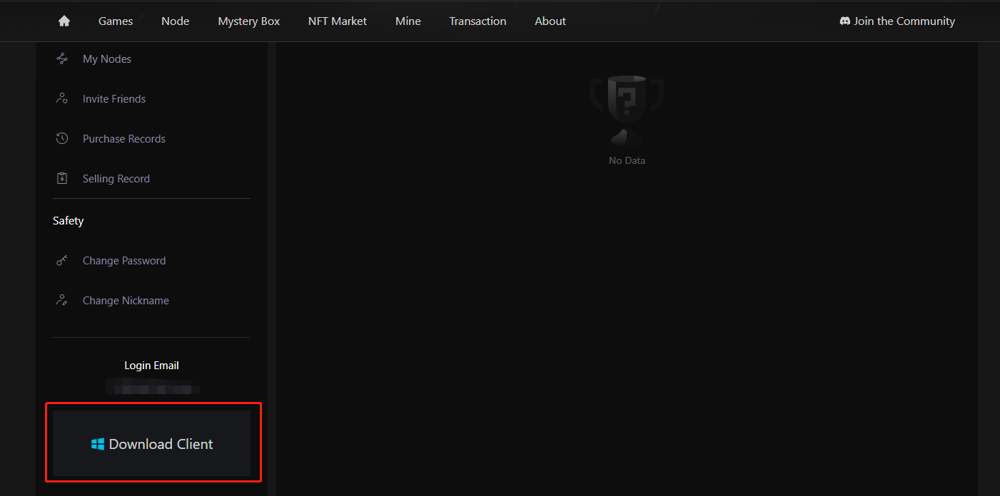

# 購買節點

### 简介

購買CHACHA Node指南

### 步驟

1.進入https://www.cha-cha.games/buy-node頁面，首先需要先登錄賬號并連接錢包。

2.登錄賬戶并連接錢包后，首次購買CHACHA Node 需要對賬戶進行授權，勾選下方同意服務協議，點擊APPROVE。

3.授權成功后，點擊購買節點后，確認支付即可完成節點的購買。

4.節點購買成功后，即可進入個人中心，點擊下載客戶端。

