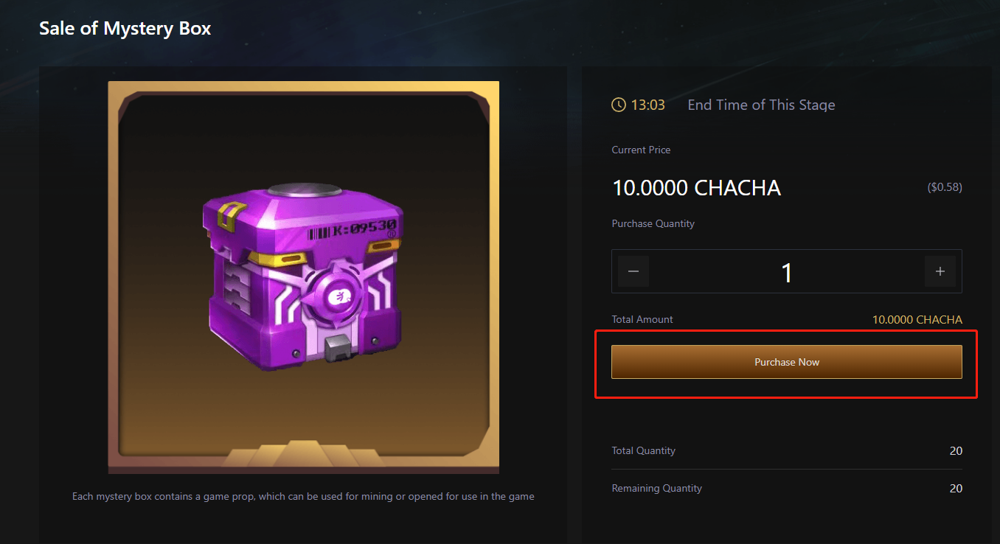

# CHACHA 盲盒

### 簡介

盲盒是CHACHA Games發行的一種獨特的NFT，每個盲盒代表一個特有的遊戲道具，用戶可在遊戲發行後打開盲盒，將其在遊戲中使用，也可在NFT市場交易，或者用來挖礦，具體可查看盲盒挖礦規則。

### 步驟

1.進入https://cha-cha.games/mystery-box-sale，登陸并連接錢包，如果是第一次購買，需進行授權。

2.授權完成后，選擇需要購買的盲盒數量，點擊購買，成功支付后即可完成購買。

