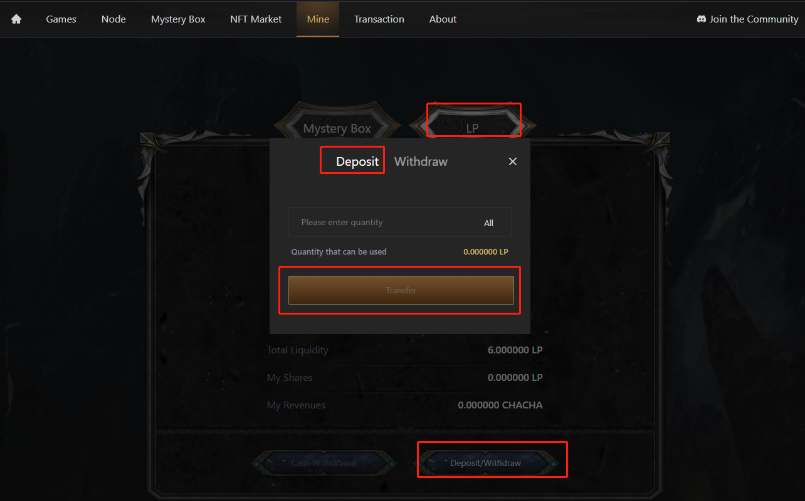
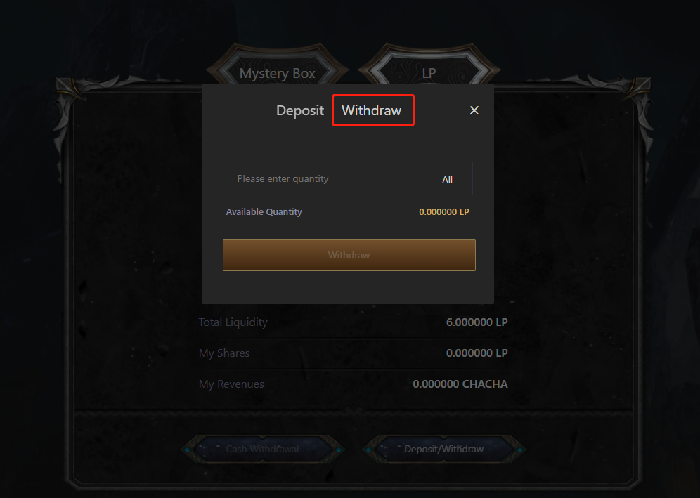
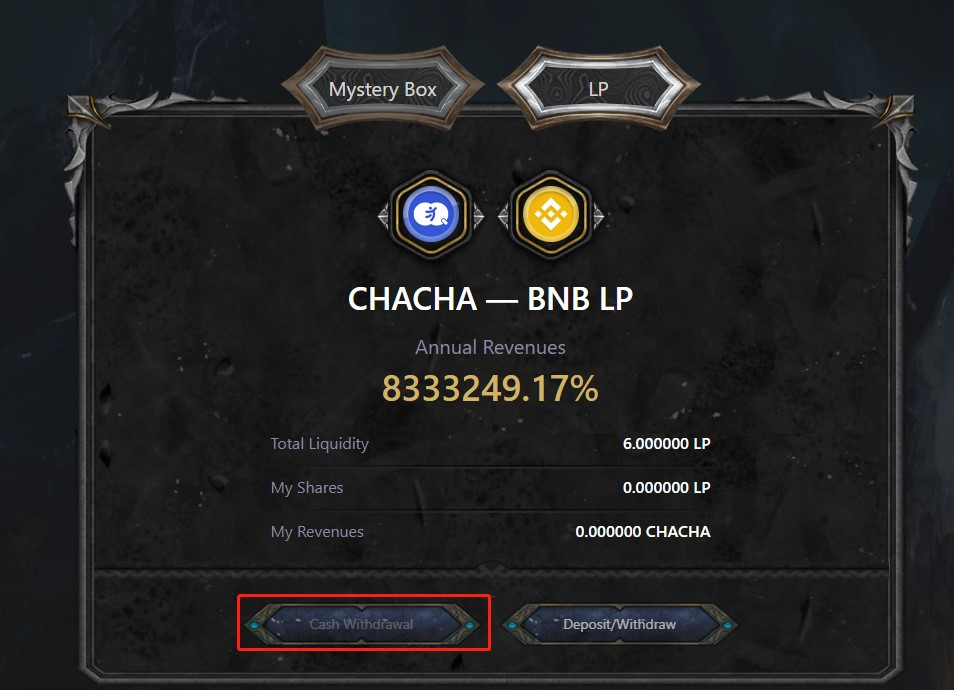

# LP挖礦

### 簡介

用戶在pancakeswap中，在CHACHA-BUSD池中提供流動性後，可將LP轉存到CHACHA Games中獲得收益。

### 如何挖礦

1.進入https://cha-cha.games/mint，先登錄賬戶且連接錢包后，点击LP -Deposit/Withdraw-Deposit，输入存入LP的数量，点击存入即可。

2.點擊Withdraw，輸入數量後，即可把挖礦的LP取出。取出後，LP將無法獲得挖礦收益。

3.點擊Receive可收取挖礦收益。

### 挖礦收益怎麼計算

LP挖礦收益的計算公式為: 每日產出CHACHA總量 X 10%（LP配額）/ LP質押總價值 X 你質押的LP總價值。

