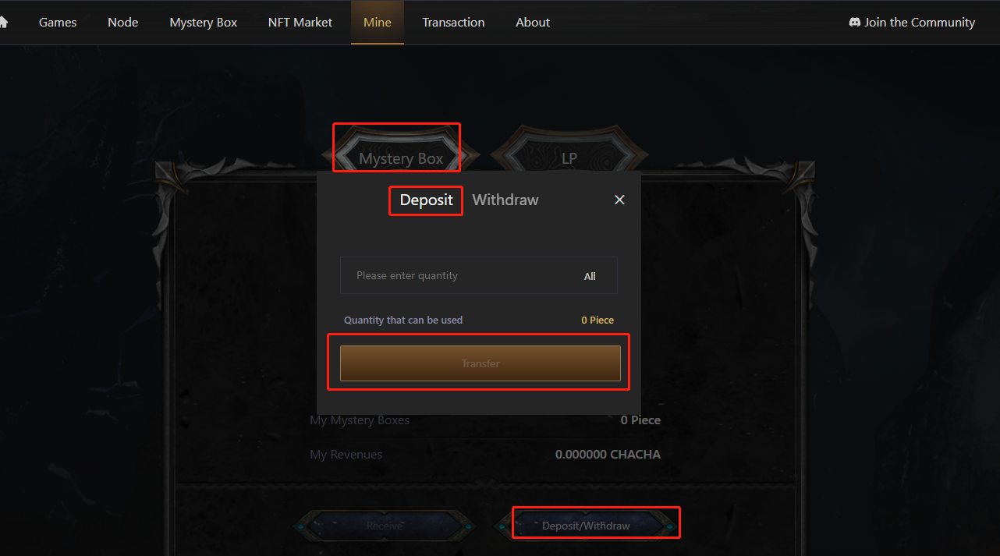
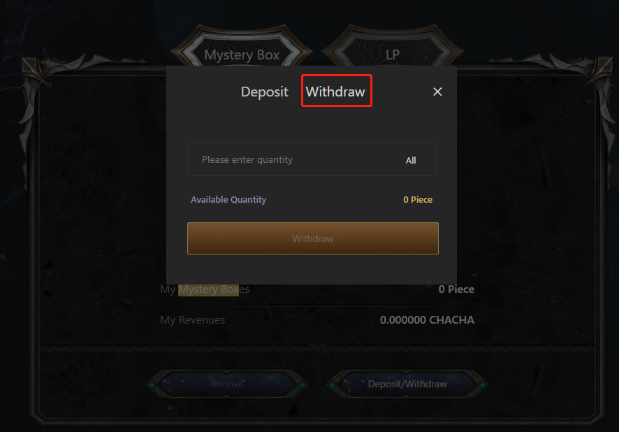
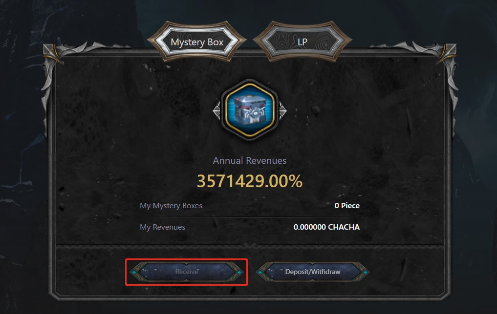

# 盲盒挖礦

### 簡介

用戶購買了盲盒之後，可質押盲盒獲得CHACHA獎勵。

### 如何挖礦

1.進入https://cha-cha.games/mint，先登錄賬戶且連接錢包后，点击Mystery Box-Deposit/Withdraw-Deposit，输入存入盲盒的数量，点击存入即可。

2.點擊Withdraw，輸入數量後，即可把挖礦的盲盒取出。取出後，盲盒將無法獲得挖礦收益。

3.點擊Receive可收取挖礦收益。

### 挖礦收益怎麼計算

盲盒挖礦收益的計算公式為：每日產出CHACHA總量 X 20%（盲盒配額）/ 盲盒質押總數 X 你質押的盲盒數，計算出結果。用該結果/你搶購盲盒的總價格，算出盲盒每U每天產出的CHACHA數量，記作x；每日產出CHACHA總量 X 50%（節點配額）/ 50000（節點總數）/節點當前價格，約等於最新的節點每U產出的CHACHA數量，記作y。

若x≤y\*60%，則該結果為盲盒挖礦數量，若不是則按照X=60%y，計算出盲盒挖礦收益。計算出的獎勵结果>節點收益的60%，則當日盲盒挖礦的收益為節點收益的60%。

